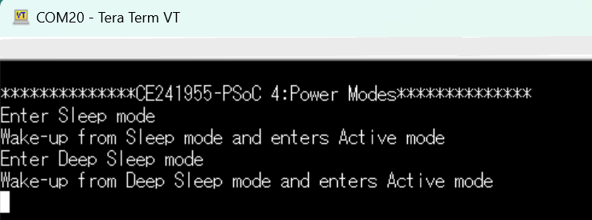
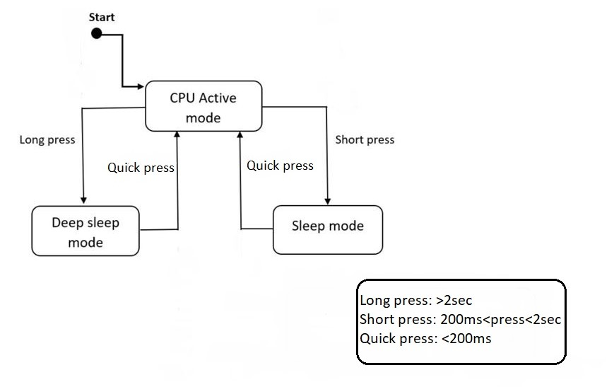

# PSOC&trade; 4: Power modes

This code example shows how to enter system Sleep and Deep Sleep modes in PSOC&trade; 4 devices. After entering Sleep or Deep Sleep mode, the example also shows how to wake up from these low-power modes and return to Active mode. See [AN86233 - PSOC&trade; 4 low-power modes and power reduction techniques](https://www.infineon.com/dgdl/Infineon-AN86233_PSOC_4_and_PSOC_Analog_Coprocessor_LowPower_Modes_and_Power_Reduction_Techniques-ApplicationNotes-v09_00-EN.pdf?fileId=8ac78c8c7cdc391c017d0737cdb15b82&utm_source=cypress&utm_medium=referral&utm_campaign=202110_globe_en_all_integration-files) for an overview of PSOC&trade; 4 low-power modes, and power-saving features and techniques.

[View this README on GitHub.](https://github.com/Infineon/mtb-example-ce241955-power-modes)

[Provide feedback on this code example.](https://cypress.co1.qualtrics.com/jfe/form/SV_1NTns53sK2yiljn?Q_EED=eyJVbmlxdWUgRG9jIElkIjoiQ0UyNDE5NTUiLCJTcGVjIE51bWJlciI6IjAwMi00MTk1NSIsIkRvYyBUaXRsZSI6IlBTT0MmdHJhZGU7IDQ6IFBvd2VyIG1vZGVzIiwicmlkIjoibWthciIsIkRvYyB2ZXJzaW9uIjoiMS4xLjAiLCJEb2MgTGFuZ3VhZ2UiOiJFbmdsaXNoIiwiRG9jIERpdmlzaW9uIjoiTUNEIiwiRG9jIEJVIjoiQVVUTyIsIkRvYyBGYW1pbHkiOiJBVVRPIFBTT0MifQ==)

## Requirements

- [ModusToolbox&trade;](https://www.infineon.com/modustoolbox) v3.5 or later (tested with v3.5)

  > **Note:** This code example version requires ModusToolbox&trade; software version 3.5 or later and is not backward compatible with v2.4 or older versions.
- Board support package (BSP) minimum required version: 3.1.0
- Programming language: C
- Associated parts: [PSOC&trade; 4 HV (High Voltage)](https://www.infineon.com/products/microcontroller/32-bit-psoc-arm-cortex/psoc-4-hv-m0)

## Supported toolchains (make variable 'TOOLCHAIN')

- GNU Arm&reg; Embedded Compiler v11.3.1 (`GCC_ARM`) – Default value of `TOOLCHAIN`
- Arm&reg; Compiler v6.22 (`ARM`)
- IAR C/C++ Compiler v9.50.2 (`IAR`)

## Supported kits (make variable 'TARGET')
- [PSOC&trade; 4 HVMS-128K Evaluation Kit](https://www.infineon.com/evaluation-board/KIT-PSOC4-HVMS-128K-LITE) (`KIT_PSOC4-HVMS-128K_LITE`) – Default value of `TARGET`
- [PSOC&trade; 4 HVMS-64K Evaluation Kit](https://www.infineon.com/evaluation-board/KIT-PSOC4-HVMS-64K-LITE) (`KIT_PSOC4-HVMS-64K_LITE`)
- [PSOC&trade; 4 HVPA-144K Evaluation Kit](https://www.infineon.com/evaluation-board/KIT-PSOC4-HVPA-144K-LITE) (`KIT_PSOC4-HVPA-144K_LITE`)
- [PSOC&trade; 4 HVPA-SPM1.0 Evaluation Kit](https://www.infineon.com/design-resources/finder-selection-tools/evaluation-board) (`KIT_PSOC-HVPA-SPM1_LITE`)

## Hardware setup

This example uses the board's default configuration for all the kits listed above. 

The example does not require any additional hardware to run. However, you can connect an ammeter to measure the current consumed by the PSOC&trade; 4 device.


See the kit guide for the exact location. If you are using any other kits, see the kit guide to know how to measure the current. It might require changes in the hardware.

> **Note:** Some of the PSOC&trade; 4 kits ship with KitProg2 installed. ModusToolbox&trade; requires KitProg3. Before using this code example, make sure that the board is upgraded to KitProg3. The tool and instructions are available in the [Firmware Loader](https://github.com/Infineon/Firmware-loader) GitHub repository. If you do not upgrade, you will see an error like "unable to find CMSIS-DAP device" or "KitProg firmware is out of date".

## Software setup

See the [ModusToolbox&trade; tools package installation guide](https://www.infineon.com/ModusToolboxInstallguide) for information about installing and configuring the tools package.

Install a terminal emulator if you don't have one. Instructions in this document use [Tera Term](https://teratermproject.github.io/index-en.html).


## Using the code example

### Create the project

The ModusToolbox&trade; tools package provides the Project Creator as both a GUI tool and a command line tool.

<details><summary><b>Use Project Creator GUI</b></summary>

1. Open the Project Creator GUI tool

   There are several ways to do this, including launching it from the dashboard or from inside the Eclipse IDE. For more details, see the [Project Creator user guide](https://www.infineon.com/ModusToolboxProjectCreator) (locally available at *{ModusToolbox&trade; install directory}/tools_{version}/project-creator/docs/project-creator.pdf*)

2. On the **Choose Board Support Package (BSP)** page, select a kit supported by this code example. See [Supported kits](#supported-kits-make-variable-target)
   > **Note:** To use this code example for a kit not listed here, you may need to update the source files. If the kit does not have the required resources, the application may not work.

3. On the **Select Application** page:

   a. Select the **Applications(s) Root Path** and the **Target IDE**

   > **Note:** Depending on how you open the Project Creator tool, these fields may be pre-selected for you.

   b.	Select this code example from the list by enabling its check box

   > **Note:** You can narrow the list of displayed examples by typing in the filter box.

   c. (Optional) Change the suggested **New Application Name** and **New BSP Name**

   d. Click **Create** to complete the application creation process

</details>

<details><summary><b>Use Project Creator CLI</b></summary>

The 'project-creator-cli' tool can be used to create applications from a CLI terminal or from within batch files or shell scripts. This tool is available in the *{ModusToolbox&trade; install directory}/tools_{version}/project-creator/* directory.

Use a CLI terminal to invoke the 'project-creator-cli' tool. On Windows, use the command-line 'modus-shell' program provided in the ModusToolbox&trade; installation instead of a standard Windows command-line application. This shell provides access to all ModusToolbox&trade; tools. You can access it by typing "modus-shell" in the search box in the Windows menu. In Linux and macOS, you can use any terminal application.

The following example clones the "[mtb-example-ce241955-power-modes](https://github.com/Infineon/mtb-example-ce241955-power-modes)" application with the desired name "Psoc4PowerModes" configured for the *KIT_PSOC4-HVMS-128K_LITE* BSP into the specified working directory, C:/mtb_projects:

   ```
   project-creator-cli --board-id KIT_PSOC4-HVMS-128K_LITE --app-id mtb-example-ce241955-power-modes --user-app-name Psoc4PowerModes --target-dir "C:/mtb_projects"
   ```

The 'project-creator-cli' tool has the following arguments:

Argument | Description | Required/optional
---------|-------------|-----------
`--board-id` | Defined in the <id> field of the [BSP](https://github.com/Infineon?q=bsp-manifest&type=&language=&sort=) manifest | Required
`--app-id`   | Defined in the <id> field of the [CE](https://github.com/Infineon?q=ce-manifest&type=&language=&sort=) manifest | Required
`--target-dir`| Specify the directory in which the application is to be created if you prefer not to use the default current working directory | Optional
`--user-app-name`| Specify the name of the application if you prefer to have a name other than the example's default name | Optional

> **Note:** The project-creator-cli tool uses the `git clone` and `make getlibs` commands to fetch the repository and import the required libraries. For details, see the "Project creator tools" section of the [ModusToolbox&trade; tools package user guide](https://www.infineon.com/ModusToolboxUserGuide) (locally available at {ModusToolbox&trade; install directory}/docs_{version}/mtb_user_guide.pdf).


</details>

### Open the project

After the project has been created, you can open it in your preferred development environment.

<details><summary><b>Eclipse IDE</b></summary>


If you opened the Project Creator tool from the included Eclipse IDE, the project will open in Eclipse automatically.

For more details, see the [Eclipse IDE for ModusToolbox&trade; user guide](https://www.infineon.com/MTBEclipseIDEUserGuide) (locally available at *{ModusToolbox&trade; install directory}/docs_{version}/mt_ide_user_guide.pdf*).

</details>


<details><summary><b>Visual Studio (VS) Code</b></summary>

Launch VS Code manually, and then open the generated *{project-name}.code-workspace* file located in the project directory.

For more details, see the [Visual Studio Code for ModusToolbox&trade; user guide](https://www.infineon.com/MTBVSCodeUserGuide) (locally available at *{ModusToolbox&trade; install directory}/docs_{version}/mt_vscode_user_guide.pdf*).

</details>


<details><summary><b>Keil µVision</b></summary>

Double-click the generated *{project-name}.cprj* file to launch the Keil µVision IDE.

For more details, see the [Keil µVision for ModusToolbox&trade; user guide](https://www.infineon.com/MTBuVisionUserGuide) (locally available at *{ModusToolbox&trade; install directory}/docs_{version}/mt_uvision_user_guide.pdf*).

</details>

<details><summary><b>IAR Embedded Workbench</b></summary>

Open IAR Embedded Workbench manually, and create a new project. Then select the generated *{project-name}.ipcf* file located in the project directory.

For more details, see the [IAR Embedded Workbench for ModusToolbox&trade; user guide](https://www.infineon.com/MTBIARUserGuide) (locally available at *{ModusToolbox&trade; install directory}/docs_{version}/mt_iar_user_guide.pdf*).

</details>

<details><summary><b>Command line</b></summary>


If you prefer to use the CLI, open the appropriate terminal, and navigate to the project directory. On Windows, use the command-line 'modus-shell' program; on Linux and macOS, you can use any terminal application. From there, you can run various `make` commands.

For more details, see the [ModusToolbox&trade; tools package user guide](https://www.infineon.com/ModusToolboxUserGuide) (locally available at *{ModusToolbox&trade; install directory}/docs_{version}/mtb_user_guide.pdf*).

</details>


## Operation

1. Connect the board to your PC using the provided USB cable through the KitProg3 USB connector.

2. Program the board using one of the following:

   <details><summary><b>Using Eclipse IDE</b></summary>

      1. Select the application project in the Project Explorer

      2. In the **Quick Panel**, scroll down, and click **\<Application Name> Program (KitProg3_MiniProg4)**

   </details>
   <details><summary><b>In other IDEs</b></summary>

   Follow the instructions in your preferred IDE.
   </details>


   <details><summary><b>Using CLI</b></summary>

     From the terminal, execute the `make program` command to build and program the application using the default toolchain to the default target. The default toolchain is specified in the application's Makefile but you can override this value manually:
      ```
      make program TOOLCHAIN=<toolchain>
      ```

      Example:
      ```
      make program TOOLCHAIN=GCC_ARM
      ```
   </details>

3. After programming, the application starts automatically. Confirm that the kit LED is in an ON state. Take note of the current consumption. The device is in a Normal Active state at this moment

4. Open the serial terminal application, (this example uses Tera Term) and set the baud rate to 115200 bps. Use the default settings for other serial port parameters

5. Press the kit button for approximately 200 ms and release it. The device will enter Sleep mode. Observe that the LED dims 10% before entering into Sleep mode. Take note of the current consumption; the current consumption has dropped to a few milliamperes. Press the button for less than 200 ms to wake up the device from Sleep mode and enter Active mode

6. Press the kit button for at least two seconds and release it. The device will enter Deep Sleep mode. Observe that the LED is OFF before entering Deep Sleep mode. Take note of the current consumption; the current consumption has dropped to a few micro amps. Button press for less than 200 ms will wake up the device from Deep Sleep mode and enter Active mode

7. The UART terminal prints the current state of the device as shown in **Figure 1**

    **Figure 1. Terminal output**

    

## Debugging

You can debug the example to step through the code.


<details><summary><b>In Eclipse IDE</b></summary>

Use the **\<Application Name> Debug (KitProg3_MiniProg4)** configuration in the **Quick Panel**. For details, see the "Program and debug" section in the [Eclipse IDE for ModusToolbox&trade; user guide](https://www.infineon.com/MTBEclipseIDEUserGuide).

</details>


<details><summary><b>In other IDEs</b></summary>

Follow the instructions in your preferred IDE.
</details>


## Design and implementation

**Figure 2. Power state machine**



This project uses an LED to show the current low power state. **Table 1** shows the state of the LED for each mode. The LED is continuously ON when the device is in Active mode.

**Table 1. LED state in various power modes**

CPU state | LED state
---------|------------
Active  |LED ON
Sleep   | Dims LED 10%
Deep Sleep  |LED OFF

<br>

This example demonstrates how to transition the PSOC&trade; 4 device between Sleep and Deep Sleep power modes. It uses a GPIO interrupt to wake up the device from the Sleep and Deep Sleep modes. The device wakes up from low-power modes when a switch press is detected. An LED is connected to an output pin; it is used for indicating the current low-power state of the device. The firmware flow is as follows:

1. Initialize the GPIO wakeup interrupt. An input pin, externally connected to a switch, is configured to generate an interrupt when the switch is pressed

2. Enable the UART peripheral for printing the debug statements

3. Enable the PWM peripheral to dim and turn ON/OFF the LED

4. Two power management callback functions are registered (Deep Sleep and Sleep callbacks). **Table 2** shows the actions of each callback function

   **Table 2. Callback functions**

Callback | Power state | CHECK_READY | CHECK_FAIL | BEFORE_TRANSITION | AFTER_TRANSITION |
----------|--------| ---------| --------- | --- | ---
Deep Sleep callback | Deep Sleep | Disable UART | Enable the UART to operate | Disable PWM   | Enable PWM, UART Components, and set LED to 100% ON
Sleep callback | Sleep | Disable UART | Enable the UART to operate | LED Dims 10% | Enable UART and set LED to 100% ON

<br>

### Resources and settings

**Table 3. Application resources**

   Resource     |  Alias/object          |    Purpose
   -------      | :------------          | :------------
   LED (BSP)    | CYBSP_USER_LED6 (KIT_PSOC-HVPA-SPM1_LITE)<br>  CYBSP_USER_LED7 (Other boards)        | User LED to show the output 
   Switch (BSP) | CYBSP_USER_BTN         | User switch to generate the interrupt
   UART (BSP)   | CYBSP_UART             | UART is used for printing the current status of the low-power state
   PWM (BSP)   | USER_PWM                | User PWM is used to drive the LED

<br>

## Related resources

Resources  | Links
-----------|----------------------------------
Application notes  | [AN0034](https://www.infineon.com/row/public/documents/10/42/infineon-an0034-getting-started-with-psoc-4-hv-ms-mcus-in-modustoolbox-applicationnotes-en.pdf) - Getting started with PSOC&trade; 4 HV MS MCUs in ModusToolbox&trade;
Code examples  | [Using ModusToolbox&trade;](https://github.com/Infineon/Code-Examples-for-ModusToolbox-Software) on GitHub
Device documentation |[PSOC&trade; high voltage (HV) mixed signal (MS) automotive MCU 128K datasheets](https://www.infineon.com/assets/row/public/documents/10/49/infineon-cy8c41x7-psoc-4-high-voltage-hv-mixed-signal-ms-automotive-mcu-based-on-32-bit-arm-cortex--m0-datasheet-en.pdf) <br>[PSOC&trade; high voltage (HV) mixed signal (MS) automotive MCU 64K datasheets](https://www.infineon.com/assets/row/public/documents/10/49/infineon-cy8c41x5-cy8c41x6-psoc-4-high-voltage-hv-mixed-signal-ms-automotive-mcu-based-on-32-bit-arm-cortex--m0-datasheet-en-09018a9080d1ff70.pdf) <br>[PSOC&trade; high voltage (HV) precision analog (PA) automotive MCU 144K datasheets](https://documentation.infineon.com/psoc4atv/docs/rsd1669346756301) <br>[PSOC&trade; high voltage (HV) precision analog (PA) automotive MCU SPM1.0 datasheets](https://www.infineon.com/products/microcontroller/32-bit-psoc-arm-cortex/psoc-4-hv-m0/hv-pa#documents) <br>[PSOC&trade; high voltage (HV) mixed signal (MS) MCU: PSOC&trade; HVMS-128K registers reference manuals](https://www.infineon.com/row/public/documents/10/57/infineon-psoc-high-voltagehvmixed-signal-msmcu-psoc-hvms-128k-registers-reference-manual-additionaltechnicalinformation-en.pdf) <br>[PSOC&trade; high voltage (HV) mixed signal (MS) MCU: PSOC&trade; HVMS-64K registers reference manuals](https://www.infineon.com/content/dam/infineon/row/public/documents/10/57/infineon-psoc-4-high-voltagehvmixed-signalmsmcu-psoc4hvms-64k-registers-reference-manual-additionaltechnicalinformation-en.pdf) <br>[PSOC&trade; high voltage (HV) precision analogl (PA) MCU: PSOC&trade; HVPA-144K registers reference manuals](https://www.infineon.com/products/microcontroller/32-bit-psoc-arm-cortex/psoc-4-hv-m0/hv-pa#!documents) <br>[PSOC&trade; high voltage (HV) precision analogl (PA) MCU: PSOC&trade; HVPA-SPM1.0 registers reference manuals](https://www.infineon.com/products/microcontroller/32-bit-psoc-arm-cortex/psoc-4-hv-m0/hv-pa#!documents) <br>[PSOC&trade; high voltage (HV) mixed signal (MS) MCU architecture reference manuals](https://www.infineon.com/assets/row/public/documents/10/57/infineon-psoc-high-voltage-hv-mixed-signal-ms-mcu-architecture-reference-manual-additionaltechnicalinformation-en.pdf) <br>[PSOC&trade; high voltage (HV) precision analog (PA) MCU architecture reference manuals](https://documentation.infineon.com/psoc4atv/docs/vkg1670389100008)
Development kits | Select your kits from the [Evaluation board finder](https://www.infineon.com/cms/en/design-support/finder-selection-tools/product-finder/evaluation-board) page.
Libraries on GitHub | [mtb-pdl-cat2](https://github.com/Infineon/mtb-pdl-cat2) – PSOC&trade; 4 Peripheral Driver Library (PDL)<br> [mtb-hal-cat2](https://github.com/Infineon/mtb-hal-cat2) – Hardware Abstraction Layer (HAL) library
Tools  | [ModusToolbox&trade;](https://www.infineon.com/modustoolbox) – ModusToolbox&trade; software is a collection of easy-to-use libraries and tools enabling rapid development with Infineon MCUs for applications ranging from wireless and cloud-connected systems, edge AI/ML, embedded sense and control, to wired USB connectivity using PSOC&trade; Industrial/IoT MCUs, AIROC&trade; Wi-Fi and Bluetooth&reg; connectivity devices, XMC&trade; Industrial MCUs, and EZ-USB&trade;/EZ-PD&trade; wired connectivity controllers. ModusToolbox&trade; incorporates a comprehensive set of BSPs, HAL, libraries, configuration tools, and provides support for industry-standard IDEs to fast-track your embedded application development.

<br>


## Other resources

Infineon provides a wealth of data at [www.infineon.com](https://www.infineon.com) to help you select the right device, and quickly and effectively integrate it into your design.

## Document history

Document title: *CE241955* - *PSOC&trade; 4: Power modes*

 Version | Description of change
 ------- | ---------------------
 1.0.0   | New code example
 1.1.0   | Added support for KIT_PSOC-HVPA-SPM1_LITE

<br>
---------------------------------------------------------

(c) 2025, Infineon Technologies AG, or an affiliate of Infineon Technologies AG. All rights reserved.
This software, associated documentation and materials ("Software") is owned by Infineon Technologies AG or one of its affiliates ("Infineon") and is protected by and subject to worldwide patent protection, worldwide copyright laws, and international treaty provisions. Therefore, you may use this Software only as provided in the license agreement accompanying the software package from which you obtained this Software. If no license agreement applies, then any use, reproduction, modification, translation, or compilation of this Software is prohibited without the express written permission of Infineon.
<br>
Disclaimer: UNLESS OTHERWISE EXPRESSLY AGREED WITH INFINEON, THIS SOFTWARE IS PROVIDED AS-IS, WITH NO WARRANTY OF ANY KIND, EXPRESS OR IMPLIED, INCLUDING, BUT NOT LIMITED TO, ALL WARRANTIES OF NON-INFRINGEMENT OF THIRD-PARTY RIGHTS AND IMPLIED WARRANTIES SUCH AS WARRANTIES OF FITNESS FOR A SPECIFIC USE/PURPOSE OR MERCHANTABILITY. Infineon reserves the right to make changes to the Software without notice. You are responsible for properly designing, programming, and testing the functionality and safety of your intended application of the Software, as well as complying with any legal requirements related to its use. Infineon does not guarantee that the Software will be free from intrusion, data theft or loss, or other breaches (“Security Breaches”), and Infineon shall have no liability arising out of any Security Breaches. Unless otherwise explicitly approved by Infineon, the Software may not be used in any application where a failure of the Product or any consequences of the use thereof can reasonably be expected to result in personal injury.